```python
# This Python 3 environment comes with many helpful analytics libraries installed
# It is defined by the kaggle/python docker image: https://github.com/kaggle/docker-python
# For example, here's several helpful packages to load in 

import numpy as np # linear algebra
import pandas as pd # data processing, CSV file I/O (e.g. pd.read_csv)

# Input data files are available in the "../input/" directory.
# For example, running this (by clicking run or pressing Shift+Enter) will list all files under the input directory

import os
for dirname, _, filenames in os.walk('/kaggle/input'):
    for filename in filenames:
        print(os.path.join(dirname, filename))

# Any results you write to the current directory are saved as output.
```


```python
!pip install -q efficientnet
```


```python
import os
import gc
import re

import cv2
import math
import numpy as np
import scipy as sp
import pandas as pd

import tensorflow as tf
from IPython.display import SVG
import efficientnet.tfkeras as efn
from keras.utils import plot_model
import tensorflow.keras.layers as L
from keras.utils import model_to_dot
import tensorflow.keras.backend as K
from tensorflow.keras.models import Model
from kaggle_datasets import KaggleDatasets
from tensorflow.keras.applications import DenseNet121

import seaborn as sns
from tqdm import tqdm
import matplotlib.cm as cm
from sklearn import metrics
import matplotlib.pyplot as plt
from sklearn.utils import shuffle
from sklearn.model_selection import train_test_split

tqdm.pandas()
import plotly.express as px
import plotly.graph_objects as go
import plotly.figure_factory as ff
from plotly.subplots import make_subplots

np.random.seed(0)
tf.random.set_seed(0)

import warnings
warnings.filterwarnings("ignore")
```

    Using TensorFlow backend.


## Data Setup


```python
EPOCHS = 10
SAMPLE_LEN = 100
IMAGE_PATH = "../input/plant-pathology-2020-fgvc7/images/"
TEST_PATH = "../input/plant-pathology-2020-fgvc7/test.csv"
TRAIN_PATH = "../input/plant-pathology-2020-fgvc7/train.csv"
SUB_PATH = "../input/plant-pathology-2020-fgvc7/sample_submission.csv"

sub = pd.read_csv(SUB_PATH)
test_data = pd.read_csv(TEST_PATH)
train_data = pd.read_csv(TRAIN_PATH)
```

## EDA of DATA


```python
def load_image(image_id):
    file_path = image_id + ".jpg"
    image = cv2.imread(IMAGE_PATH + file_path)
    return cv2.cvtColor(image, cv2.COLOR_BGR2RGB)

train_images = train_data["image_id"][:SAMPLE_LEN].progress_apply(load_image)
```

    100%|██████████| 100/100 [00:04<00:00, 21.36it/s]


```python
fig = px.imshow(cv2.resize(train_images[0], (205, 136)))
fig.show()
```


```python
red_values = [np.mean(train_images[idx][:, :, 0]) for idx in range(len(train_images))]
green_values = [np.mean(train_images[idx][:, :, 1]) for idx in range(len(train_images))]
blue_values = [np.mean(train_images[idx][:, :, 2]) for idx in range(len(train_images))]
values = [np.mean(train_images[idx]) for idx in range(len(train_images))]
```


```python
fig = ff.create_distplot([values], group_labels=["Channels"], colors=["purple"])
fig.update_layout(showlegend=False, template="simple_white")
fig.update_layout(title_text="Distribution of channel values")
fig.data[0].marker.line.color = 'rgb(0, 0, 0)'
# fig.data[0].marker.line.width = 0.5
fig
```


```python
fig = ff.create_distplot([red_values], group_labels=["R"], colors=["red"])
fig.update_layout(showlegend=False, template="simple_white")
fig.update_layout(title_text="Distribution of red channel values")
fig.data[0].marker.line.color = 'rgb(0, 0, 0)'
fig.data[0].marker.line.width = 0.5
fig
```


```python
fig = ff.create_distplot([green_values], group_labels=["G"], colors=["green"])
fig.update_layout(showlegend=False, template="simple_white")
fig.update_layout(title_text="Distribution of green channel values")
fig.data[0].marker.line.color = 'rgb(0, 0, 0)'
fig.data[0].marker.line.width = 0.5
fig
```


```python
fig = ff.create_distplot([blue_values], group_labels=["B"], colors=["blue"])
fig.update_layout(showlegend=False, template="simple_white")
fig.update_layout(title_text="Distribution of blue channel values")
fig.data[0].marker.line.color = 'rgb(0, 0, 0)'
fig.data[0].marker.line.width = 0.5
fig
```


```python
fig = go.Figure()

for idx, values in enumerate([red_values, green_values, blue_values]):
    if idx == 0:
        color = "Red"
    if idx == 1:
        color = "Green"
    if idx == 2:
        color = "Blue"
    fig.add_trace(go.Box(x=[color]*len(values), y=values, name=color, marker=dict(color=color.lower())))
    
fig.update_layout(yaxis_title="Mean value", xaxis_title="Color channel",
                  title="Mean value vs. Color channel", template="plotly_white")
```


```python
fig = ff.create_distplot([red_values, green_values, blue_values],
                         group_labels=["R", "G", "B"],
                         colors=["red", "green", "blue"])
fig.update_layout(title_text="Distribution of red channel values", template="simple_white")
fig.data[0].marker.line.color = 'rgb(0, 0, 0)'
fig.data[0].marker.line.width = 0.5
fig.data[1].marker.line.color = 'rgb(0, 0, 0)'
fig.data[1].marker.line.width = 0.5
fig.data[2].marker.line.color = 'rgb(0, 0, 0)'
fig.data[2].marker.line.width = 0.5
fig
```


```python
def visualize_leaves(cond=[0, 0, 0, 0], cond_cols=["healthy"], is_cond=True):
    if not is_cond:
        cols, rows = 3, min([3, len(train_images)//3])
        fig, ax = plt.subplots(nrows=rows, ncols=cols, figsize=(30, rows*20/3))
        for col in range(cols):
            for row in range(rows):
                ax[row, col].imshow(train_images.loc[train_images.index[-row*3-col-1]])
        return None
        
    cond_0 = "healthy == {}".format(cond[0])
    cond_1 = "scab == {}".format(cond[1])
    cond_2 = "rust == {}".format(cond[2])
    cond_3 = "multiple_diseases == {}".format(cond[3])
    
    cond_list = []
    for col in cond_cols:
        if col == "healthy":
            cond_list.append(cond_0)
        if col == "scab":
            cond_list.append(cond_1)
        if col == "rust":
            cond_list.append(cond_2)
        if col == "multiple_diseases":
            cond_list.append(cond_3)
    
    data = train_data.loc[:100]
    for cond in cond_list:
        data = data.query(cond)
        
    images = train_images.loc[list(data.index)]
    cols, rows = 3, min([3, len(images)//3])
    
    fig, ax = plt.subplots(nrows=rows, ncols=cols, figsize=(30, rows*20/3))
    for col in range(cols):
        for row in range(rows):
            ax[row, col].imshow(images.loc[images.index[row*3+col]])
    plt.show()
```


```python
visualize_leaves(cond=[1, 0, 0, 0], cond_cols=["healthy"])
```


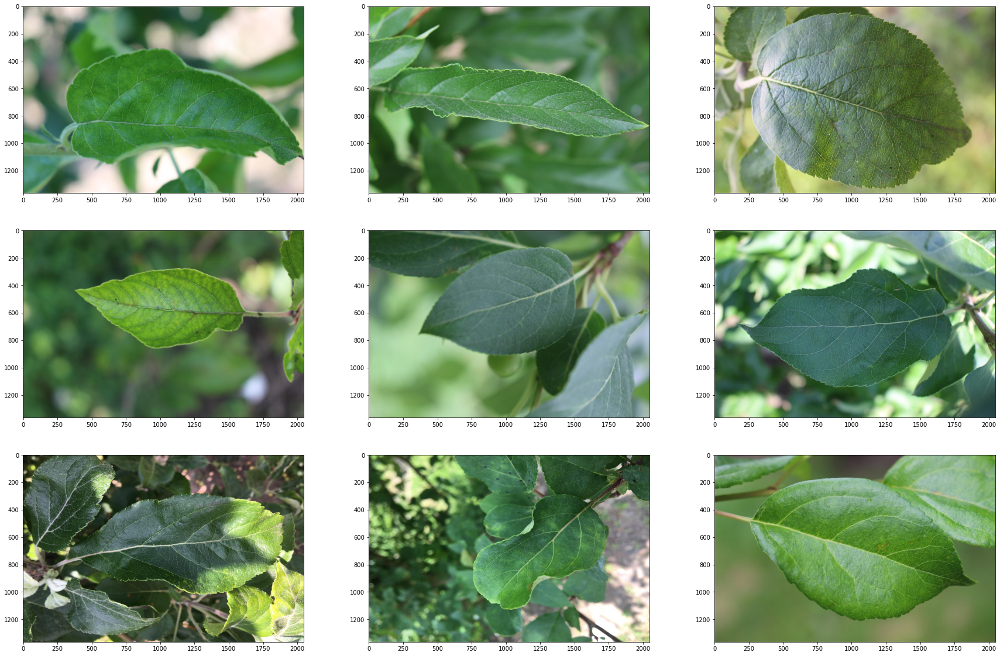


```python
visualize_leaves(cond=[0, 1, 0, 0], cond_cols=["scab"])
```


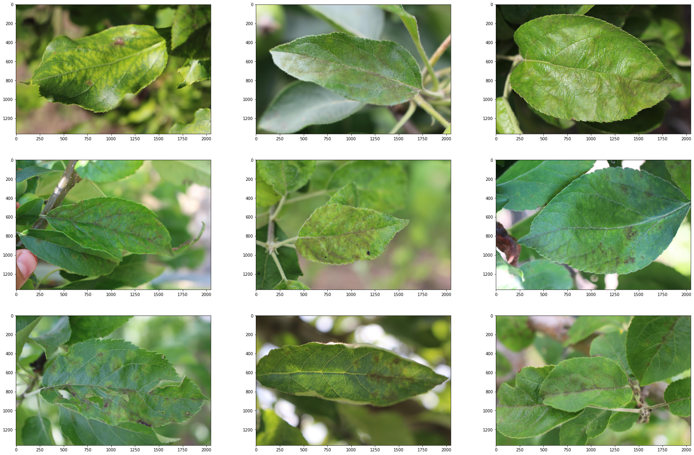


```python
visualize_leaves(cond=[0, 0, 1, 0], cond_cols=["rust"])
```


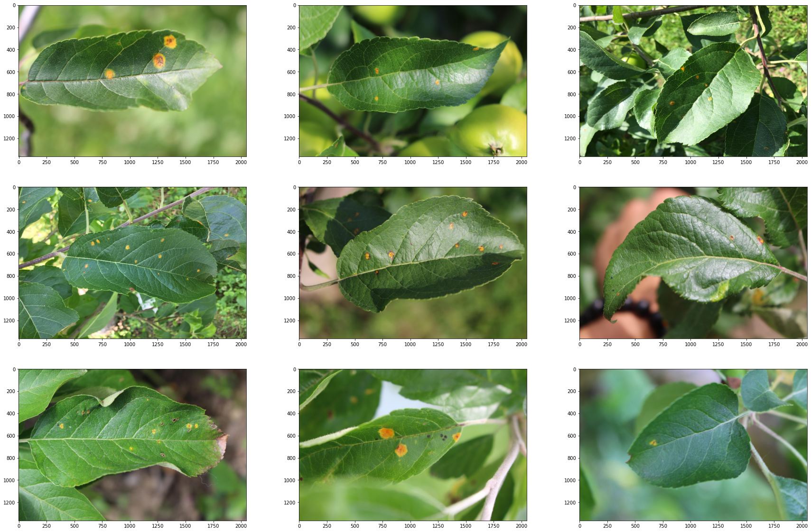


```python
visualize_leaves(cond=[0, 0, 0, 1], cond_cols=["multiple_diseases"])
```


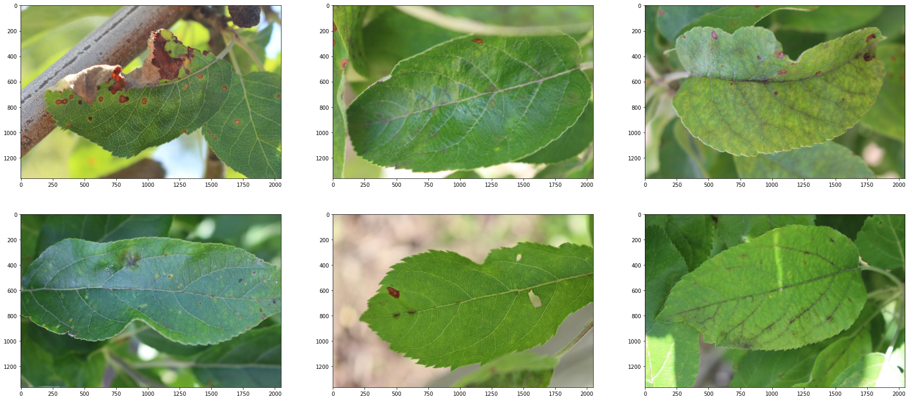


```python
fig = px.parallel_categories(train_data[["healthy", "scab", "rust", "multiple_diseases"]], color="healthy", color_continuous_scale="sunset",\
                             title="Parallel categories plot of targets")
fig
```


```python

```


```python
fig = go.Figure([go.Pie(labels=train_data.columns[1:],
           values=train_data.iloc[:, 1:].sum().values)])
fig.update_layout(title_text="Pie chart of targets", template="simple_white")
fig.data[0].marker.line.color = 'rgb(0, 0, 0)'
fig.data[0].marker.line.width = 0.5
fig.show()
```


```python
train_data["Healthy"] = train_data["healthy"].apply(bool).apply(str)
fig = px.histogram(train_data, x="Healthy", title="Healthy distribution", color="Healthy",\
            color_discrete_map={
                "True": px.colors.qualitative.Plotly[0],
                "False": px.colors.qualitative.Plotly[1]})
fig.update_layout(template="simple_white")
fig.data[0].marker.line.color = 'rgb(0, 0, 0)'
fig.data[0].marker.line.width = 0.5
fig.data[1].marker.line.color = 'rgb(0, 0, 0)'
fig.data[1].marker.line.width = 0.5
fig
```


## Image Processing

Canny edge detection


```python
def edge_and_cut(img):
    emb_img = img.copy()
    edges = cv2.Canny(img, 100, 200)
    edge_coors = []
    for i in range(edges.shape[0]):
        for j in range(edges.shape[1]):
            if edges[i][j] != 0:
                edge_coors.append((i, j))
    
    row_min = edge_coors[np.argsort([coor[0] for coor in edge_coors])[0]][0]
    row_max = edge_coors[np.argsort([coor[0] for coor in edge_coors])[-1]][0]
    col_min = edge_coors[np.argsort([coor[1] for coor in edge_coors])[0]][1]
    col_max = edge_coors[np.argsort([coor[1] for coor in edge_coors])[-1]][1]
    new_img = img[row_min:row_max, col_min:col_max]
    
    emb_img[row_min-10:row_min+10, col_min:col_max] = [255, 0, 0]
    emb_img[row_max-10:row_max+10, col_min:col_max] = [255, 0, 0]
    emb_img[row_min:row_max, col_min-10:col_min+10] = [255, 0, 0]
    emb_img[row_min:row_max, col_max-10:col_max+10] = [255, 0, 0]
    
    fig, ax = plt.subplots(nrows=1, ncols=3, figsize=(30, 20))
    ax[0].imshow(img, cmap='gray')
    ax[0].set_title('Original Image', fontsize=24)
    ax[1].imshow(edges, cmap='gray')
    ax[1].set_title('Canny Edges', fontsize=24)
    ax[2].imshow(emb_img, cmap='gray')
    ax[2].set_title('Bounding Box', fontsize=24)
    plt.show()
```


```python
edge_and_cut(train_images[3])
edge_and_cut(train_images[4])
edge_and_cut(train_images[5])
```


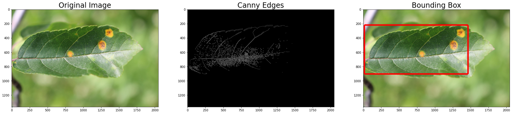


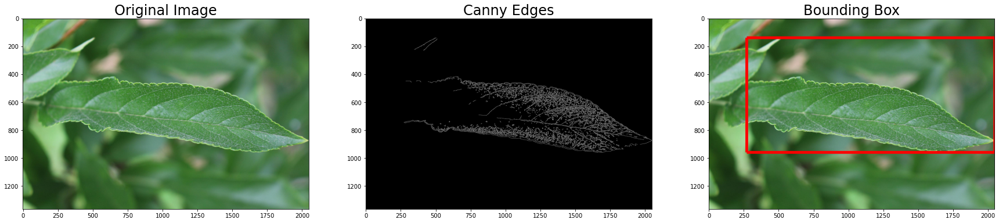


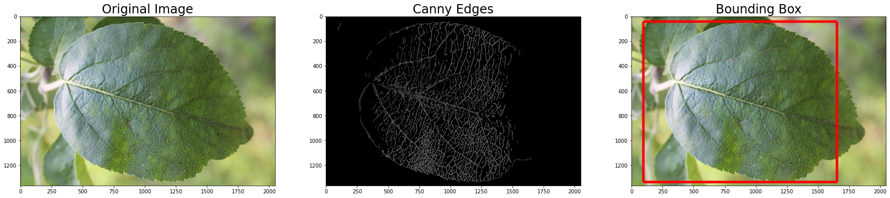


```python
def invert(img):
    fig, ax = plt.subplots(nrows=1, ncols=3, figsize=(30, 20))
    ax[0].imshow(img)
    ax[0].set_title('Original Image', fontsize=24)
    ax[1].imshow(cv2.flip(img, 0))
    ax[1].set_title('Vertical Flip', fontsize=24)
    ax[2].imshow(cv2.flip(img, 1))
    ax[2].set_title('Horizontal Flip', fontsize=24)
    plt.show()
```


```python
invert(train_images[3])
invert(train_images[4])
invert(train_images[5])
```


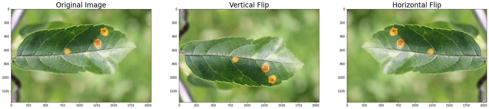


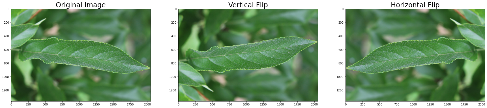


```python
def conv(img):
    fig, ax = plt.subplots(nrows=1, ncols=2, figsize=(20, 20))
    kernel = np.ones((7, 7), np.float32)/25
    conv = cv2.filter2D(img, -1, kernel)
    ax[0].imshow(img)
    ax[0].set_title('Original Image', fontsize=24)
    ax[1].imshow(conv)
    ax[1].set_title('Convolved Image', fontsize=24)
    plt.show()
```


```python
conv(train_images[3])
conv(train_images[4])
conv(train_images[5])
```


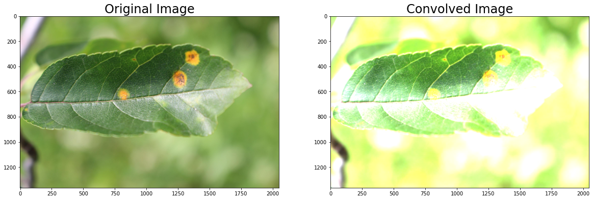


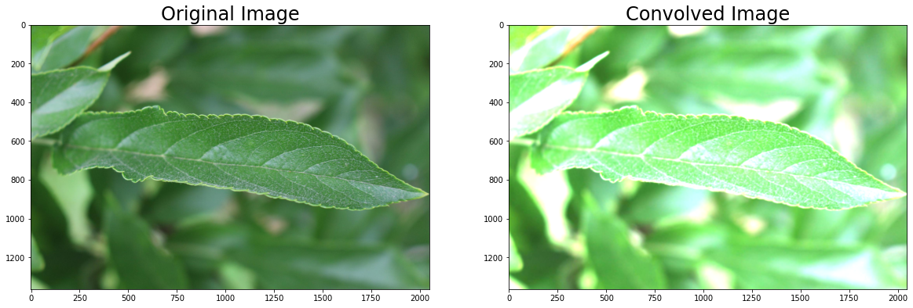


```python
def blur(img):
    fig, ax = plt.subplots(nrows = 1, ncols = 2, figsize = (20,20))
    ax[0].imshow(img)
    ax[0].set_title("Original Image", fontsize = 24)
    ax[1].imshow(cv2.blur(img, (100, 100)))
    ax[1].set_title("Blurred Image", fontsize = 24)
    plt.show()
```


```python
blur(train_images[1])
blur(train_images[2])
blur(train_images[3])
```


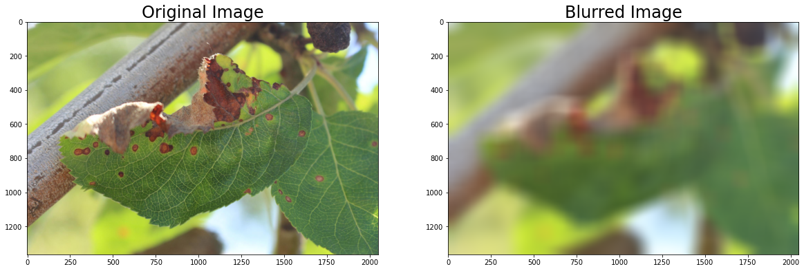


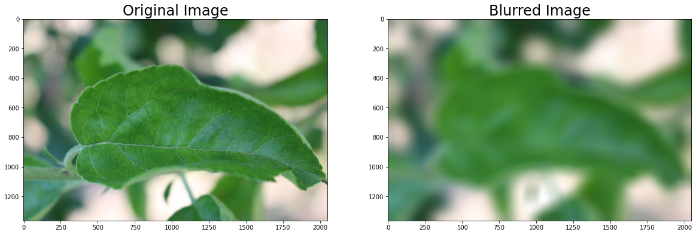


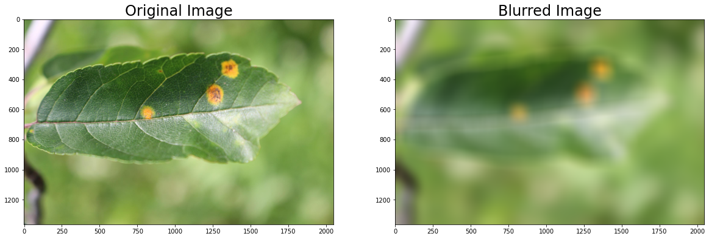


## Modelling


```python
AUTO = tf.data.experimental.AUTOTUNE
tpu = tf.distribute.cluster_resolver.TPUClusterResolver()

tf.config.experimental_connect_to_cluster(tpu)
tf.tpu.experimental.initialize_tpu_system(tpu)
strategy = tf.distribute.experimental.TPUStrategy(tpu)

BATCH_SIZE = 16 * strategy.num_replicas_in_sync
GCS_DS_PATH = KaggleDatasets().get_gcs_path()
```


```python
def format_path(st):
    return GCS_DS_PATH + '/images/' + st + '.jpg'

test_paths = test_data.image_id.apply(format_path).values
train_paths = train_data.image_id.apply(format_path).values


train_labels = np.float32(train_data.loc[:, 'healthy':'scab'].values)
train_paths, valid_paths, train_labels, valid_labels =\
train_test_split(train_paths, train_labels, test_size=0.15, random_state=2020)
```


```python

```


```python
def decode_image(filename, label=None, image_size=(512, 512)):
    bits = tf.io.read_file(filename)
    image = tf.image.decode_jpeg(bits, channels=3)
    image = tf.cast(image, tf.float32) / 255.0
    image = tf.image.resize(image, image_size)
    
    if label is None:
        return image
    else:
        return image, label

def data_augment(image, label=None):
    image = tf.image.random_flip_left_right(image)
    image = tf.image.random_flip_up_down(image)
    
    if label is None:
        return image
    else:
        return image, label
```

### Create dataset objects


```python
train_dataset = (
    tf.data.Dataset
    .from_tensor_slices((train_paths, train_labels))
    .map(decode_image, num_parallel_calls=AUTO)
    .map(data_augment, num_parallel_calls=AUTO)
    .repeat()
    .shuffle(512)
    .batch(BATCH_SIZE)
    .prefetch(AUTO)
)

valid_dataset = (
    tf.data.Dataset
    .from_tensor_slices((valid_paths, valid_labels))
    .map(decode_image, num_parallel_calls=AUTO)
    .batch(BATCH_SIZE)
    .cache()
    .prefetch(AUTO)
)

test_dataset = (
    tf.data.Dataset
    .from_tensor_slices(test_paths)
    .map(decode_image, num_parallel_calls=AUTO)
    .batch(BATCH_SIZE)
)

```

### Helper functions


```python
def build_lrfn(lr_start=0.00001, lr_max=0.00005, 
               lr_min=0.00001, lr_rampup_epochs=5, 
               lr_sustain_epochs=0, lr_exp_decay=.8):
    lr_max = lr_max * strategy.num_replicas_in_sync

    def lrfn(epoch):
        if epoch < lr_rampup_epochs:
            lr = (lr_max - lr_start) / lr_rampup_epochs * epoch + lr_start
        elif epoch < lr_rampup_epochs + lr_sustain_epochs:
            lr = lr_max
        else:
            lr = (lr_max - lr_min) *\
                 lr_exp_decay**(epoch - lr_rampup_epochs\
                                - lr_sustain_epochs) + lr_min
        return lr
    return lrfn
            
```

### Define hypermeters and callbacks


```python
lrfn = build_lrfn()
STEPS_PER_EPOCH = train_labels.shape[0] // BATCH_SIZE
lr_schedule = tf.keras.callbacks.LearningRateScheduler(lrfn, verbose=1)
```


```python

```

## DenseNet:


```python
with strategy.scope():
    model = tf.keras.Sequential([DenseNet121(input_shape=(512, 512, 3),
                                             weights='imagenet',
                                             include_top=False),
                                 L.GlobalAveragePooling2D(),
                                 L.Dense(train_labels.shape[1],
                                         activation='softmax')])
        
    model.compile(optimizer='adam',
                  loss = 'categorical_crossentropy',
                  metrics=['categorical_accuracy'])
    model.summary()
```

    Downloading data from https://github.com/keras-team/keras-applications/releases/download/densenet/densenet121_weights_tf_dim_ordering_tf_kernels_notop.h5
    29089792/29084464 [==============================] - 8s 0us/step
    Model: "sequential"
    _________________________________________________________________
    Layer (type)                 Output Shape              Param #   
    =================================================================
    densenet121 (Model)          (None, 16, 16, 1024)      7037504   
    _________________________________________________________________
    global_average_pooling2d (Gl (None, 1024)              0         
    _________________________________________________________________
    dense (Dense)                (None, 4)                 4100      
    =================================================================
    Total params: 7,041,604
    Trainable params: 6,957,956
    Non-trainable params: 83,648
    _________________________________________________________________


```python
SVG(tf.keras.utils.model_to_dot(Model(model.layers[0].input, model.layers[0]
                                     .layers[13].output), dpi = 70).create(prog = 'dot', format = 'svg'))
```


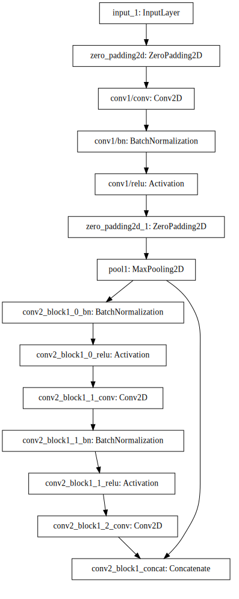


# Train Model


```python
# valid_dataset
```


```python
history = model.fit(train_dataset,
                    epochs=EPOCHS,
                    callbacks=[lr_schedule],
                    steps_per_epoch=STEPS_PER_EPOCH,
                    validation_data=valid_dataset)
```

    Train for 12 steps, validate for 3 steps
    
    Epoch 00001: LearningRateScheduler reducing learning rate to 1e-05.
    Epoch 1/10
    12/12 [==============================] - 220s 18s/step - loss: 1.3123 - categorical_accuracy: 0.3613 - val_loss: 1.2694 - val_categorical_accuracy: 0.3723
    
    Epoch 00002: LearningRateScheduler reducing learning rate to 8.8e-05.
    Epoch 2/10
    12/12 [==============================] - 4s 364ms/step - loss: 0.7695 - categorical_accuracy: 0.7357 - val_loss: 0.9415 - val_categorical_accuracy: 0.6460
    
    Epoch 00003: LearningRateScheduler reducing learning rate to 0.000166.
    Epoch 3/10
    12/12 [==============================] - 20s 2s/step - loss: 0.3141 - categorical_accuracy: 0.9004 - val_loss: 1.0914 - val_categorical_accuracy: 0.5547
    
    Epoch 00004: LearningRateScheduler reducing learning rate to 0.000244.
    Epoch 4/10
    12/12 [==============================] - 28s 2s/step - loss: 0.2331 - categorical_accuracy: 0.9219 - val_loss: 0.9356 - val_categorical_accuracy: 0.6460
    
    Epoch 00005: LearningRateScheduler reducing learning rate to 0.000322.
    Epoch 5/10
    12/12 [==============================] - 28s 2s/step - loss: 0.1281 - categorical_accuracy: 0.9603 - val_loss: 0.5917 - val_categorical_accuracy: 0.7993
    
    Epoch 00006: LearningRateScheduler reducing learning rate to 0.0004.
    Epoch 6/10
    12/12 [==============================] - 28s 2s/step - loss: 0.0873 - categorical_accuracy: 0.9753 - val_loss: 0.3385 - val_categorical_accuracy: 0.8905
    
    Epoch 00007: LearningRateScheduler reducing learning rate to 0.000322.
    Epoch 7/10
    12/12 [==============================] - 29s 2s/step - loss: 0.0901 - categorical_accuracy: 0.9740 - val_loss: 0.4044 - val_categorical_accuracy: 0.8175
    
    Epoch 00008: LearningRateScheduler reducing learning rate to 0.0002596000000000001.
    Epoch 8/10
    12/12 [==============================] - 30s 3s/step - loss: 0.0524 - categorical_accuracy: 0.9870 - val_loss: 0.2023 - val_categorical_accuracy: 0.9161
    
    Epoch 00009: LearningRateScheduler reducing learning rate to 0.00020968000000000004.
    Epoch 9/10
    12/12 [==============================] - 30s 2s/step - loss: 0.0370 - categorical_accuracy: 0.9909 - val_loss: 0.1786 - val_categorical_accuracy: 0.9270
    
    Epoch 00010: LearningRateScheduler reducing learning rate to 0.00016974400000000002.
    Epoch 10/10
    12/12 [==============================] - 29s 2s/step - loss: 0.0346 - categorical_accuracy: 0.9935 - val_loss: 0.1538 - val_categorical_accuracy: 0.9343


```python
# display_training_curves(
#     history.history['categorical_accuracy'], 
#     history.history['val_categorical_accuracy'], 
#     'accuracy')
```


```python
probs_dnn = model.predict(test_dataset, verbose=1)
sub.loc[:, 'healthy':] = probs_dnn
sub.to_csv('submission_dnn.csv', index=False)
sub.head()
```

    15/15 [==============================] - 113s 8s/step


<div>
<style scoped>
    .dataframe tbody tr th:only-of-type {
        vertical-align: middle;
    }

    .dataframe tbody tr th {
        vertical-align: top;
    }

    .dataframe thead th {
        text-align: right;
    }
</style>
<table border="1" class="dataframe">
  <thead>
    <tr style="text-align: right;">
      <th></th>
      <th>image_id</th>
      <th>healthy</th>
      <th>multiple_diseases</th>
      <th>rust</th>
      <th>scab</th>
    </tr>
  </thead>
  <tbody>
    <tr>
      <th>0</th>
      <td>Test_0</td>
      <td>0.000024</td>
      <td>4.666151e-03</td>
      <td>0.995309</td>
      <td>1.711687e-06</td>
    </tr>
    <tr>
      <th>1</th>
      <td>Test_1</td>
      <td>0.001341</td>
      <td>2.324979e-02</td>
      <td>0.975070</td>
      <td>3.389512e-04</td>
    </tr>
    <tr>
      <th>2</th>
      <td>Test_2</td>
      <td>0.000484</td>
      <td>2.461074e-03</td>
      <td>0.000106</td>
      <td>9.969490e-01</td>
    </tr>
    <tr>
      <th>3</th>
      <td>Test_3</td>
      <td>0.999845</td>
      <td>2.431769e-07</td>
      <td>0.000155</td>
      <td>1.848917e-07</td>
    </tr>
    <tr>
      <th>4</th>
      <td>Test_4</td>
      <td>0.000019</td>
      <td>3.182899e-03</td>
      <td>0.996759</td>
      <td>3.932256e-05</td>
    </tr>
  </tbody>
</table>
</div>


```python

```

## EfficientNet


```python
with strategy.scope():
    model = tf.keras.Sequential([efn.EfficientNetB7(input_shape=(512, 512, 3),
                                                    weights='imagenet',
                                                    include_top=False),
                                 L.GlobalAveragePooling2D(),
                                 L.Dense(train_labels.shape[1],
                                         activation='softmax')])
    
    
        
    model.compile(optimizer='adam',
                  loss = 'categorical_crossentropy',
                  metrics=['categorical_accuracy'])
    model.summary()
```

    Downloading data from https://github.com/Callidior/keras-applications/releases/download/efficientnet/efficientnet-b7_weights_tf_dim_ordering_tf_kernels_autoaugment_notop.h5
    258441216/258434480 [==============================] - 4s 0us/step
    Model: "sequential_1"
    _________________________________________________________________
    Layer (type)                 Output Shape              Param #   
    =================================================================
    efficientnet-b7 (Model)      (None, 16, 16, 2560)      64097680  
    _________________________________________________________________
    global_average_pooling2d_1 ( (None, 2560)              0         
    _________________________________________________________________
    dense_1 (Dense)              (None, 4)                 10244     
    =================================================================
    Total params: 64,107,924
    Trainable params: 63,797,204
    Non-trainable params: 310,720
    _________________________________________________________________


```python
history = model.fit(train_dataset,
                    epochs=EPOCHS,
                    callbacks=[lr_schedule],
                    steps_per_epoch=STEPS_PER_EPOCH,
                    validation_data=valid_dataset)
```

    Train for 12 steps, validate for 3 steps
    
    Epoch 00001: LearningRateScheduler reducing learning rate to 1e-05.
    Epoch 1/10
    12/12 [==============================] - 353s 29s/step - loss: 1.3779 - categorical_accuracy: 0.2962 - val_loss: 1.2296 - val_categorical_accuracy: 0.3759
    
    Epoch 00002: LearningRateScheduler reducing learning rate to 8.8e-05.
    Epoch 2/10
    12/12 [==============================] - 12s 965ms/step - loss: 1.1803 - categorical_accuracy: 0.6296 - val_loss: 1.0676 - val_categorical_accuracy: 0.6387
    
    Epoch 00003: LearningRateScheduler reducing learning rate to 0.000166.
    Epoch 3/10
    12/12 [==============================] - 12s 965ms/step - loss: 0.5462 - categorical_accuracy: 0.8659 - val_loss: 0.8101 - val_categorical_accuracy: 0.7007
    
    Epoch 00004: LearningRateScheduler reducing learning rate to 0.000244.
    Epoch 4/10
    12/12 [==============================] - 12s 986ms/step - loss: 0.2873 - categorical_accuracy: 0.9154 - val_loss: 0.4742 - val_categorical_accuracy: 0.8029
    
    Epoch 00005: LearningRateScheduler reducing learning rate to 0.000322.
    Epoch 5/10
    12/12 [==============================] - 20s 2s/step - loss: 0.2076 - categorical_accuracy: 0.9375 - val_loss: 0.2250 - val_categorical_accuracy: 0.9197
    
    Epoch 00006: LearningRateScheduler reducing learning rate to 0.0004.
    Epoch 6/10
    12/12 [==============================] - 30s 2s/step - loss: 0.1528 - categorical_accuracy: 0.9564 - val_loss: 0.2489 - val_categorical_accuracy: 0.9197
    
    Epoch 00007: LearningRateScheduler reducing learning rate to 0.000322.
    Epoch 7/10
    12/12 [==============================] - 29s 2s/step - loss: 0.1271 - categorical_accuracy: 0.9622 - val_loss: 0.3934 - val_categorical_accuracy: 0.8832
    
    Epoch 00008: LearningRateScheduler reducing learning rate to 0.0002596000000000001.
    Epoch 8/10
    12/12 [==============================] - 29s 2s/step - loss: 0.0911 - categorical_accuracy: 0.9701 - val_loss: 0.3326 - val_categorical_accuracy: 0.9051
    
    Epoch 00009: LearningRateScheduler reducing learning rate to 0.00020968000000000004.
    Epoch 9/10
    12/12 [==============================] - 30s 3s/step - loss: 0.0658 - categorical_accuracy: 0.9779 - val_loss: 0.3329 - val_categorical_accuracy: 0.9124
    
    Epoch 00010: LearningRateScheduler reducing learning rate to 0.00016974400000000002.
    Epoch 10/10
    12/12 [==============================] - 29s 2s/step - loss: 0.0713 - categorical_accuracy: 0.9720 - val_loss: 0.4056 - val_categorical_accuracy: 0.9051


```python
# display_training_curves(
#     history.history['categorical_accuracy'], 
#     history.history['val_categorical_accuracy'], 
#     'accuracy')
```


```python
# acc_df = pd.DataFrame(np.transpose([[*np.arange(1, EPOCHS+1).tolist()*3], ["Train"]*EPOCHS + ["Val"]*EPOCHS + ["Benchmark"]*EPOCHS,
#                                      history.history['categorical_accuracy'] + history.history['val_categorical_accuracy'] + [1.0]*EPOCHS]))
# acc_df.columns = ["Epochs", "Stage", "Accuracy"]
# fig = px.bar(acc_df, x="Accuracy", y="Stage", animation_frame="Epochs", title="Accuracy vs. Epochs", color='Stage',
#        color_discrete_map={"Train":"dodgerblue", "Val":"darkorange", "Benchmark":"seagreen"}, orientation="h")

# fig.update_layout(
#     xaxis = dict(
#         autorange=False,
#         range=[0, 1]
#     )
# )

# fig.update_layout(template="plotly_white")
```


```python
probs_efn = model.predict(test_dataset, verbose=1)
sub.loc[:, 'healthy':] = probs_efn
sub.to_csv('submission_efn.csv', index=False)
sub.head()
```

    15/15 [==============================] - 62s 4s/step


<div>
<style scoped>
    .dataframe tbody tr th:only-of-type {
        vertical-align: middle;
    }

    .dataframe tbody tr th {
        vertical-align: top;
    }

    .dataframe thead th {
        text-align: right;
    }
</style>
<table border="1" class="dataframe">
  <thead>
    <tr style="text-align: right;">
      <th></th>
      <th>image_id</th>
      <th>healthy</th>
      <th>multiple_diseases</th>
      <th>rust</th>
      <th>scab</th>
    </tr>
  </thead>
  <tbody>
    <tr>
      <th>0</th>
      <td>Test_0</td>
      <td>4.824462e-04</td>
      <td>4.327098e-04</td>
      <td>0.999084</td>
      <td>1.080375e-06</td>
    </tr>
    <tr>
      <th>1</th>
      <td>Test_1</td>
      <td>6.709785e-07</td>
      <td>2.126490e-04</td>
      <td>0.999753</td>
      <td>3.412408e-05</td>
    </tr>
    <tr>
      <th>2</th>
      <td>Test_2</td>
      <td>3.216038e-03</td>
      <td>1.363012e-03</td>
      <td>0.000190</td>
      <td>9.952311e-01</td>
    </tr>
    <tr>
      <th>3</th>
      <td>Test_3</td>
      <td>9.999930e-01</td>
      <td>9.505931e-08</td>
      <td>0.000007</td>
      <td>1.571344e-09</td>
    </tr>
    <tr>
      <th>4</th>
      <td>Test_4</td>
      <td>1.715337e-05</td>
      <td>4.258213e-04</td>
      <td>0.999522</td>
      <td>3.477098e-05</td>
    </tr>
  </tbody>
</table>
</div>


```python

```

## EfficientNet Noisy Student


```python
with strategy.scope():
    model = tf.keras.Sequential([efn.EfficientNetB7(input_shape=(512, 512, 3),
                                                    weights='noisy-student',
                                                    include_top=False),
                                 L.GlobalAveragePooling2D(),
                                 L.Dense(train_labels.shape[1],
                                         activation='softmax')])
    
    
        
    model.compile(optimizer='adam',
                  loss = 'categorical_crossentropy',
                  metrics=['categorical_accuracy'])
    model.summary()
```

    Downloading data from https://github.com/qubvel/efficientnet/releases/download/v0.0.1/efficientnet-b7_noisy-student_notop.h5
    258072576/258068648 [==============================] - 3s 0us/step
    Model: "sequential_2"
    _________________________________________________________________
    Layer (type)                 Output Shape              Param #   
    =================================================================
    efficientnet-b7 (Model)      (None, 16, 16, 2560)      64097680  
    _________________________________________________________________
    global_average_pooling2d_2 ( (None, 2560)              0         
    _________________________________________________________________
    dense_2 (Dense)              (None, 4)                 10244     
    =================================================================
    Total params: 64,107,924
    Trainable params: 63,797,204
    Non-trainable params: 310,720
    _________________________________________________________________


```python
history = model.fit(train_dataset,
                    epochs=EPOCHS,
                    callbacks=[lr_schedule],
                    steps_per_epoch=STEPS_PER_EPOCH,
                    validation_data=valid_dataset)
```

    Train for 12 steps, validate for 3 steps
    
    Epoch 00001: LearningRateScheduler reducing learning rate to 1e-05.
    Epoch 1/10
    12/12 [==============================] - 327s 27s/step - loss: 1.3970 - categorical_accuracy: 0.2637 - val_loss: 1.3221 - val_categorical_accuracy: 0.1277
    
    Epoch 00002: LearningRateScheduler reducing learning rate to 8.8e-05.
    Epoch 2/10
    12/12 [==============================] - 12s 970ms/step - loss: 1.2221 - categorical_accuracy: 0.4844 - val_loss: 1.2968 - val_categorical_accuracy: 0.0985
    
    Epoch 00003: LearningRateScheduler reducing learning rate to 0.000166.
    Epoch 3/10
    12/12 [==============================] - 12s 968ms/step - loss: 0.8577 - categorical_accuracy: 0.7409 - val_loss: 0.7045 - val_categorical_accuracy: 0.7153
    
    Epoch 00004: LearningRateScheduler reducing learning rate to 0.000244.
    Epoch 4/10
    12/12 [==============================] - 12s 976ms/step - loss: 0.4423 - categorical_accuracy: 0.8757 - val_loss: 0.5518 - val_categorical_accuracy: 0.7883
    
    Epoch 00005: LearningRateScheduler reducing learning rate to 0.000322.
    Epoch 5/10
    12/12 [==============================] - 22s 2s/step - loss: 0.3037 - categorical_accuracy: 0.9043 - val_loss: 0.6888 - val_categorical_accuracy: 0.7372
    
    Epoch 00006: LearningRateScheduler reducing learning rate to 0.0004.
    Epoch 6/10
    12/12 [==============================] - 29s 2s/step - loss: 0.2022 - categorical_accuracy: 0.9362 - val_loss: 0.4593 - val_categorical_accuracy: 0.8431
    
    Epoch 00007: LearningRateScheduler reducing learning rate to 0.000322.
    Epoch 7/10
    12/12 [==============================] - 29s 2s/step - loss: 0.1801 - categorical_accuracy: 0.9473 - val_loss: 0.3086 - val_categorical_accuracy: 0.8686
    
    Epoch 00008: LearningRateScheduler reducing learning rate to 0.0002596000000000001.
    Epoch 8/10
    12/12 [==============================] - 29s 2s/step - loss: 0.1691 - categorical_accuracy: 0.9447 - val_loss: 0.4505 - val_categorical_accuracy: 0.8431
    
    Epoch 00009: LearningRateScheduler reducing learning rate to 0.00020968000000000004.
    Epoch 9/10
    12/12 [==============================] - 28s 2s/step - loss: 0.1132 - categorical_accuracy: 0.9694 - val_loss: 0.4668 - val_categorical_accuracy: 0.8504
    
    Epoch 00010: LearningRateScheduler reducing learning rate to 0.00016974400000000002.
    Epoch 10/10
    12/12 [==============================] - 29s 2s/step - loss: 0.0908 - categorical_accuracy: 0.9727 - val_loss: 0.4589 - val_categorical_accuracy: 0.8504


```python
probs_efnns = model.predict(test_dataset, verbose=1)
sub.loc[:, 'healthy':] = probs_efnns
sub.to_csv('submission_efnns.csv', index=False)
sub.head()
```

    15/15 [==============================] - 55s 4s/step


<div>
<style scoped>
    .dataframe tbody tr th:only-of-type {
        vertical-align: middle;
    }

    .dataframe tbody tr th {
        vertical-align: top;
    }

    .dataframe thead th {
        text-align: right;
    }
</style>
<table border="1" class="dataframe">
  <thead>
    <tr style="text-align: right;">
      <th></th>
      <th>image_id</th>
      <th>healthy</th>
      <th>multiple_diseases</th>
      <th>rust</th>
      <th>scab</th>
    </tr>
  </thead>
  <tbody>
    <tr>
      <th>0</th>
      <td>Test_0</td>
      <td>7.283952e-05</td>
      <td>0.000585</td>
      <td>0.999339</td>
      <td>0.000004</td>
    </tr>
    <tr>
      <th>1</th>
      <td>Test_1</td>
      <td>1.686778e-07</td>
      <td>0.001052</td>
      <td>0.998904</td>
      <td>0.000044</td>
    </tr>
    <tr>
      <th>2</th>
      <td>Test_2</td>
      <td>9.359945e-04</td>
      <td>0.000755</td>
      <td>0.000025</td>
      <td>0.998284</td>
    </tr>
    <tr>
      <th>3</th>
      <td>Test_3</td>
      <td>9.999659e-01</td>
      <td>0.000006</td>
      <td>0.000023</td>
      <td>0.000006</td>
    </tr>
    <tr>
      <th>4</th>
      <td>Test_4</td>
      <td>1.691733e-04</td>
      <td>0.004936</td>
      <td>0.992543</td>
      <td>0.002352</td>
    </tr>
  </tbody>
</table>
</div>


```python

```


```python
ensemble_1, ensemble_2, ensemble_3 = [sub]*3

ensemble_1.loc[:, 'healthy':] = 0.50*probs_dnn + 0.50*probs_efn
ensemble_2.loc[:, 'healthy':] = 0.25*probs_dnn + 0.75*probs_efn
ensemble_3.loc[:, 'healthy':] = 0.75*probs_dnn + 0.25*probs_efn

ensemble_1.to_csv('submission_ensemble_1.csv', index=False)
ensemble_2.to_csv('submission_ensemble_2.csv', index=False)
ensemble_3.to_csv('submission_ensemble_3.csv', index=False)
```


```python

```


```python

```
